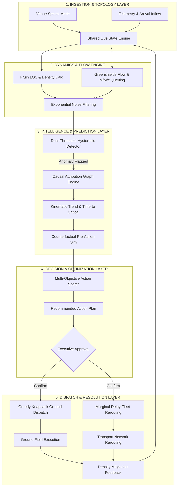
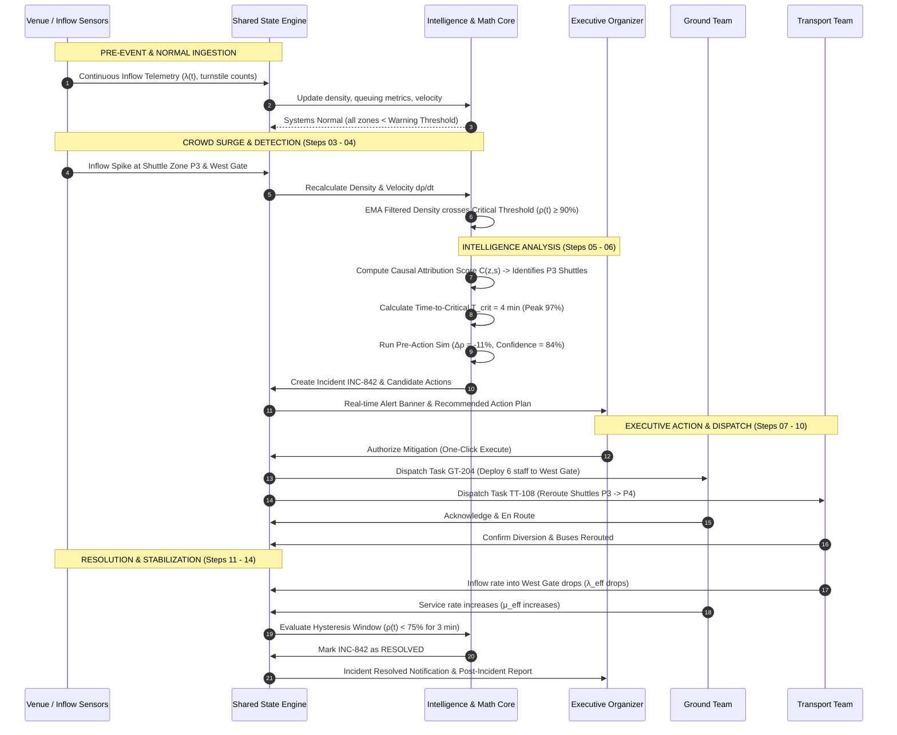
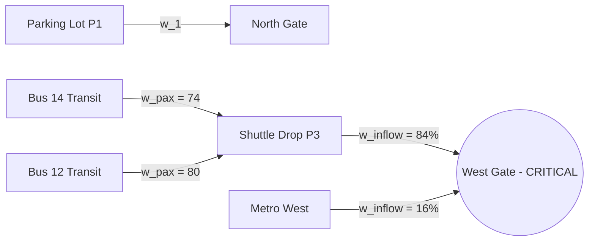
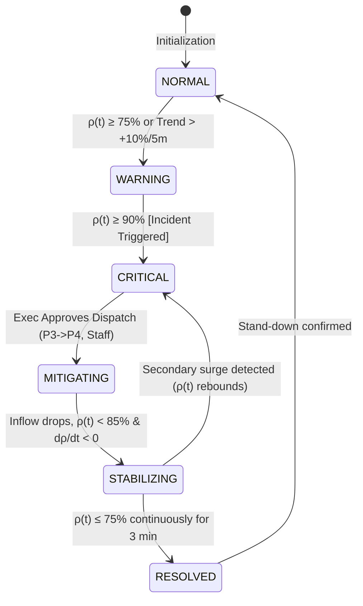

# STADIA — End-to-End System, Algorithmic & Mathematical Specification (Hover Reference)

> **Document Type:** Technical & Algorithmic Specification  
> **Target Path:** `md/hover.md`  
> **Branch:** `hc001`  
> **Scope:** Complete end-to-end lifecycle flow, stage-by-stage algorithms, exact mathematical formulations, Mermaid architectural diagrams, and interactive UI hover/tooltip inspection data contracts.

---

## Table of Contents

1. [System Overview & Architecture Pipeline](#1-system-overview--architecture-pipeline)
2. [End-to-End Lifecycle Flow Diagram](#2-end-to-end-lifecycle-flow-diagram)
3. [Stage-by-Stage Algorithmic & Mathematical Specifications](#3-stage-by-stage-algorithmic--mathematical-specifications)
   - [Stage 01: Venue Topology, Spatial Density & LOS Initialization](#stage-01-venue-topology-spatial-density--los-initialization)
   - [Stage 02: Inflow Generation & Arrival Distributions](#stage-02-inflow-generation--arrival-distributions)
   - [Stage 03: Gate Queuing Dynamics & Bottleneck Processing](#stage-03-gate-queuing-dynamics--bottleneck-processing)
   - [Stage 04: Real-Time Anomaly, Smoothing & Threshold Detection](#stage-04-real-time-anomaly-smoothing--threshold-detection)
   - [Stage 05: Root-Cause Attribution & Flow Graph Traversal](#stage-05-root-cause-attribution--flow-graph-traversal)
   - [Stage 06: Predictive Trajectory & Pre-Action Counterfactual Modeling](#stage-06-predictive-trajectory--pre-action-counterfactual-modeling)
   - [Stage 07: Multi-Objective Recommendation & Decision Scoring](#stage-07-multi-objective-recommendation--decision-scoring)
   - [Stage 08: Constrained Ground Personnel Dispatch Optimization](#stage-08-constrained-ground-personnel-dispatch-optimization)
   - [Stage 09: Dynamic Fleet Routing & Queue Delay Balancing](#stage-09-dynamic-fleet-routing--queue-delay-balancing)
   - [Stage 10: Closed-Loop Stabilization, Hysteresis & Resolution](#stage-10-closed-loop-stabilization-hysteresis--resolution)
4. [Interactive UI Hover & Inspection Specifications](#4-interactive-ui-hover--inspection-specifications)
   - [4.1 Zone Polygon Hover](#41-zone-polygon-hover)
   - [4.2 Gate / Turnstile Node Hover](#42-gate--turnstile-node-hover)
   - [4.3 Shuttle / Fleet Vehicle Hover](#43-shuttle--fleet-vehicle-hover)
   - [4.4 Ground Personnel Squad Hover](#44-ground-personnel-squad-hover)
   - [4.5 AI Incident & Recommendation Hover](#45-ai-incident--recommendation-hover)
5. [Master Reference Matrix](#5-master-reference-matrix)

---

## 1. System Overview & Architecture Pipeline

STADIA operates on a continuous event-driven reactive state loop. A centralized shared state model (`eventState`) is continuously updated by telemetry (sensors, camera turnstiles, GPS trackers on shuttles, and check-in radios). 



---

## 2. End-to-End Lifecycle Flow Diagram



---

## 3. Stage-by-Stage Algorithmic & Mathematical Specifications

### Stage 01: Venue Topology, Spatial Density & LOS Initialization

#### 1. Purpose
Define the physical geometry of the stadium, segment the space into discrete convex polygons (zones $z \in Z$), and initialize spatial capacity metrics according to international crowd safety standards.

#### 2. Algorithm Used
- **Spatial Subdivision:** Voronoi tessellation / Convex Polygon Decomposition.
- **Fruin’s Level of Service (LOS) Framework:** Categorization of pedestrian density from LOS A (free circulation) to LOS F (critical crowd crush risk).

#### 3. Mathematical Formulation

##### A. Spatial Crowd Density ($\rho_z(t)$)
$$\rho_z(t) = \frac{N_z(t)}{A_{z,\text{usable}}}$$
Where:
- $N_z(t)$ = Total headcount inside zone $z$ at time $t$ [persons].
- $A_{z,\text{usable}} = A_{z,\text{gross}} - A_{z,\text{obstacles}}$ = Usable walkable surface area [$\text{m}^2$].
- $\rho_z(t)$ = Pedestrian density [$\text{persons}/\text{m}^2$].

##### B. Fruin Level of Service (LOS) Mapping
$$\text{LOS}(\rho) = \begin{cases} 
\mathbf{A} & \text{if } \rho < 0.27 \text{ persons/m}^2 \quad (\text{Free walking, bypass freely}) \\
\mathbf{B} & \text{if } 0.27 \le \rho < 0.43 \text{ persons/m}^2 \quad (\text{Normal walking, minor conflicts}) \\
\mathbf{C} & \text{if } 0.43 \le \rho < 0.72 \text{ persons/m}^2 \quad (\text{Restricted walking speed}) \\
\mathbf{D} & \text{if } 0.72 \le \rho < 1.08 \text{ persons/m}^2 \quad (\text{Severe restriction, shuffling}) \\
\mathbf{E} & \text{if } 1.08 \le \rho < 2.17 \text{ persons/m}^2 \quad (\text{Capacity limit, intermittent halts}) \\
\mathbf{F} & \text{if } \rho \ge 2.17 \text{ persons/m}^2 \quad (\text{Crush conditions, shockwaves, dangerous})
\end{cases}$$

##### C. Safe Operating Thresholds
$$\text{Warning Threshold } \rho_{\text{warn}} = 1.08 \text{ persons/m}^2 \quad (\text{LOS D boundary})$$
$$\text{Critical Threshold } \rho_{\text{crit}} = 1.80 \text{ persons/m}^2 \quad (\text{LOS E/F boundary})$$

---

### Stage 02: Inflow Generation & Arrival Distributions

#### 1. Purpose
Model the stochastics of fan arrivals arriving from external parking lots, rail transit, and shuttle drop-offs toward gates.

#### 2. Algorithm Used
- **Non-Homogeneous Poisson Process (NHPP):** Models time-varying arrival surges with a time-dependent intensity function $\lambda(t)$.
- **Gaussian Pulse Superposition:** Simulates peak rush hours before match kickoff.

#### 3. Mathematical Formulation

##### A. Non-Homogeneous Poisson Arrival Rate $\lambda(t)$
$$\lambda(t) = \lambda_{\text{base}} + \sum_{k=1}^{K} A_k \exp\left( -\frac{(t - \tau_k)^2}{2 \sigma_k^2} \right)$$
Where:
- $\lambda_{\text{base}}$ = Background trickle arrival rate [persons/min].
- $A_k$ = Amplitude of arrival surge $k$ (e.g., train arrival or batch shuttle drop) [persons/min].
- $\tau_k$ = Peak arrival epoch for batch $k$ [min].
- $\sigma_k$ = Temporal dispersion of batch $k$ [min].

##### B. Probability of $n$ Arrivals in Window $[t, t + \Delta t]$
$$P(N(t + \Delta t) - N(t) = n) = \frac{(\Lambda(t, \Delta t))^n e^{-\Lambda(t, \Delta t)}}{n!}$$
Where the cumulative expectation $\Lambda(t, \Delta t)$ is:
$$\Lambda(t, \Delta t) = \int_{t}^{t + \Delta t} \lambda(u) \, du$$

---

### Stage 03: Gate Queuing Dynamics & Bottleneck Processing

#### 1. Purpose
Determine pedestrian wait times, queue build-ups, and choke points at entry turnstiles, security bag checks, and gate corridors.

#### 2. Algorithm Used
- **Greenshields Hydrodynamic Speed-Density Model:** Pedestrian speed decays monotonically as density rises.
- **$M/M/c$ / $M/G/c$ Multi-Server Queuing Theory & Little's Law:** Models turnstiles as parallel service channels.

#### 3. Mathematical Formulation

##### A. Greenshields Speed-Density Relation
$$v_z(\rho_z) = v_f \left( 1 - \frac{\rho_z}{\rho_{\text{jam}}} \right)$$
Where:
- $v_f$ = Free-flow walking velocity ($\approx 1.34 \text{ m/s}$).
- $\rho_{\text{jam}}$ = Theoretical jam density ($\approx 5.4 \text{ persons/m}^2$, complete physical gridlock).
- $v_z(\rho_z)$ = Actual realized crowd velocity [m/s].

##### B. Flow Rate Capacity ($Q$)
$$Q_z = \rho_z \cdot v_z(\rho_z) \cdot W_{z,\text{eff}} = \rho_z \cdot v_f \left( 1 - \frac{\rho_z}{\rho_{\text{jam}}} \right) W_{z,\text{eff}}$$
Maximum flow capacity ($Q_{\max}$) occurs at critical density $\rho = \frac{\rho_{\text{jam}}}{2} \approx 2.7 \text{ persons/m}^2$:
$$Q_{\max} = \frac{v_f \cdot \rho_{\text{jam}} \cdot W_{z,\text{eff}}}{4}$$
Where $W_{z,\text{eff}}$ is the effective walkway width [meters].

##### C. Turnstile Multi-Server Queuing ($M/M/c$)
Let gate $g$ have $c_g$ operational turnstiles, arrival rate $\lambda_g$, and each lane process $\mu_g$ persons/min:
- **Traffic Intensity / Utilization:**
  $$\rho_g = \frac{\lambda_g}{c_g \mu_g}$$
  *(System is stable if and only if $\rho_g < 1.0$)*
- **Little's Law for Average Queue Length ($L_q$) and Wait Time ($W_q$):**
  $$L_q = \lambda_g W_q$$
- **Average Turnstile Queue Delay ($W_q$ via Erlang-C):**
  $$C(c_g, a) = \frac{\frac{a^{c_g}}{c_g!} \frac{1}{1 - \rho_g}}{\sum_{k=0}^{c_g - 1}\frac{a^k}{k!} + \frac{a^{c_g}}{c_g!} \frac{1}{1 - \rho_g}}, \quad \text{where } a = \frac{\lambda_g}{\mu_g}$$
  $$W_q = \frac{C(c_g, a)}{c_g \mu_g - \lambda_g}$$

---

### Stage 04: Real-Time Anomaly, Smoothing & Threshold Detection

#### 1. Purpose
Ingest noisy real-time telemetry from camera feeds and sensors, remove transient jitter, compute the rate of density change, and trigger alerts without false flapping.

#### 2. Algorithm Used
- **Exponential Moving Average (EMA) / Low-Pass 1st-Order IIR Filter:** Noise rejection.
- **Finite-Difference Kinematic Velocity & Acceleration:** Tracking crowd pressure trends.
- **Dual-Threshold Schmitt Trigger (Hysteresis):** Prevents alert oscillation.

#### 3. Mathematical Formulation

##### A. Exponential Moving Average Smoothing
$$\bar{\rho}_z(t) = \alpha \cdot \rho_{z,\text{raw}}(t) + (1 - \alpha) \cdot \bar{\rho}_z(t - \Delta t)$$
Where $\alpha \in (0, 1]$ is the smoothing factor ($\alpha = \frac{2}{N+1}$, typically $\alpha = 0.35$ for 5-second sampling).

##### B. Crowd Density Velocity ($\vec{v}_{\rho}$) & Acceleration ($\vec{a}_{\rho}$)
$$\vec{v}_{\rho}(t) = \frac{d\bar{\rho}_z}{dt} \approx \frac{\bar{\rho}_z(t) - \bar{\rho}_z(t - \Delta t)}{\Delta t} \quad \left[\frac{\text{persons/m}^2}{\text{min}}\right]$$
$$\vec{a}_{\rho}(t) = \frac{d^2\bar{\rho}_z}{dt^2} \approx \frac{\vec{v}_{\rho}(t) - \vec{v}_{\rho}(t - \Delta t)}{\Delta t}$$

##### C. Schmitt Trigger Dual-Threshold Alert Logic
$$\text{AlertState}(t) = \begin{cases}
\mathbf{CRITICAL} & \text{if } \bar{\rho}_z(t) \ge \rho_{\text{crit}} \quad \text{or} \quad (\bar{\rho}_z(t) \ge \rho_{\text{warn}} \land \vec{v}_{\rho}(t) > v_{\text{threshold}}) \\
\mathbf{WARNING}  & \text{if } \rho_{\text{warn}} \le \bar{\rho}_z(t) < \rho_{\text{crit}} \\
\mathbf{NORMAL}   & \text{if } \bar{\rho}_z(t) \le \rho_{\text{reset}} \quad (\text{where } \rho_{\text{reset}} = \rho_{\text{warn}} - \delta_{\text{hysteresis}})
\end{cases}$$

---

### Stage 05: Root-Cause Attribution & Flow Graph Traversal

#### 1. Purpose
When a congestion spike occurs in a zone (e.g., West Gate), determine *why* and *from where* the excess crowd is originating (e.g., Shuttle Drop P3 vs. Main Car Park).

#### 2. Algorithm Used
- **Directed Acyclic Flow Graph (DAG) Attribution:** Inflow backward tracking along transit edges.
- **Weighted Attribution Scoring Matrix:** Ranks contributing feeder nodes.

#### 3. Mathematical Formulation



##### Attribution Score $C(z, s)$ for Upstream Source $s$ Feeding Congested Zone $z$:
$$C(z, s) = w_1 \cdot \left(\frac{F_{s \to z}(t)}{\sum_{i \in \text{Sources}(z)} F_{i \to z}(t)}\right) + w_2 \cdot \left(\frac{\Delta F_{s \to z}}{\Delta t}\right)_{\text{norm}} + w_3 \cdot \left(\frac{N_{\text{transit}}(s \to z)}{C_{\text{capacity}}(z)}\right)$$
Where:
- $F_{s \to z}(t)$ = Instantaneous flow rate from source $s$ into zone $z$ [persons/min].
- $N_{\text{transit}}(s \to z)$ = Passengers currently aboard vehicles en route from $s$ to $z$.
- $w_1 + w_2 + w_3 = 1.0$ (calibrated weights: $w_1 = 0.50$, $w_2 = 0.30$, $w_3 = 0.20$).
- If $C(z, s) \ge 0.65$, node $s$ is designated as the **Primary Causal Driver**.

---

### Stage 06: Predictive Trajectory & Pre-Action Counterfactual Modeling

#### 1. Purpose
Forecast when a zone will reach dangerous gridlock if no intervention is taken, and compute counterfactual outcomes showing what will happen *if* specific executive mitigations are executed.

#### 2. Algorithm Used
- **1st & 2nd Order Kinematic Extrapolation with Asymptotic Saturation:** Predicts baseline trajectory.
- **Counterfactual Difference Equation:** Evaluates policy actions before execution.

#### 3. Mathematical Formulation

##### A. Unmitigated Time-to-Critical ($T_{\text{crit}}$)
Given current smoothed density $\bar{\rho}(t)$, rate of rise $\vec{v}_{\rho}(t)$, and critical ceiling $\rho_{\text{crit}}$:
$$T_{\text{crit}} = \begin{cases}
0 & \text{if } \bar{\rho}(t) \ge \rho_{\text{crit}} \quad (\text{Already Critical}) \\
\frac{\rho_{\text{crit}} - \bar{\rho}(t)}{\max\left(\epsilon, \, \vec{v}_{\rho}(t) + \frac{1}{2} \vec{a}_{\rho}(t) \Delta t\right)} & \text{if } \vec{v}_{\rho}(t) > 0 \\
\infty & \text{if } \vec{v}_{\rho}(t) \le 0 \quad (\text{Decreasing or stable})
\end{cases}$$

##### B. Peak Unmitigated Density Forecast ($\hat{\rho}_{\text{peak}}$)
$$\hat{\rho}_{\text{peak}} = \min\left( \rho_{\text{jam}}, \; \bar{\rho}(t) + \int_{t}^{t + \Delta T_{\text{horizon}}} \left[\frac{\lambda_{\text{in}}(u) - Q_{\text{out}}(u)}{A_{\text{usable}}}\right] du \right)$$

##### C. Counterfactual Impact Equation (Pre-Action What-If Simulation)
If executive applies action set $a = \{ \text{Reroute Shuttles } P3 \to P4, \; \text{Deploy } \Delta S \text{ Staff} \}$:
$$\lambda_{\text{effective}}(t) = \lambda_{\text{baseline}}(t) - \Delta \lambda_{\text{reroute}}(t)$$
$$\mu_{\text{effective}}(t) = \mu_{\text{baseline}}(t) + \beta_{\text{staff}} \cdot \Delta S$$
$$\hat{\rho}_{\text{mitigated}}(t + \Delta t) = \bar{\rho}(t) + \frac{1}{A_{\text{usable}}} \int_{t}^{t + \Delta t} \left[\lambda_{\text{effective}}(u) - c \cdot \mu_{\text{effective}}(u)\right] du$$

##### D. Model Confidence Score ($\kappa$)
$$\kappa = 1.0 - \left(0.4 \cdot \frac{\sigma_{\text{sensor}}}{\bar{\rho}} + 0.3 \cdot \frac{\Delta T_{\text{forecast}}}{30 \text{ min}} + 0.3 \cdot (1 - R^2_{\text{trend}})\right)$$
*(Produces confidence metrics, e.g., "84% confidence")*

---

### Stage 07: Multi-Objective Recommendation & Decision Scoring

#### 1. Purpose
Synthesize candidate interventions, rank them, and select the Pareto-optimal combination for executive review.

#### 2. Algorithm Used
- **Multi-Attribute Utility Theory (MAUT) / Weighted Objective Function:** Balances congestion mitigation against operational cost, travel friction, and deployment lag.

#### 3. Mathematical Formulation

##### Utility Objective Function ($U(a)$)
For candidate mitigation action $a \in \mathcal{A}$:
$$\max_{a} U(a) = w_{\text{rel}} \cdot \Delta \rho_{\text{relief}}(a) - w_{\text{time}} \cdot T_{\text{deploy}}(a) - w_{\text{cost}} \cdot C_{\text{ops}}(a) - w_{\text{disp}} \cdot D_{\text{disruption}}(a)$$
Subject to constraints:
- $T_{\text{deploy}}(a) \le T_{\text{crit}}$ (Action must deploy before catastrophic breach).
- $S_{\text{required}}(a) \le S_{\text{available}}$ (Cannot exceed available reserve personnel).
- $V_{\text{reroute}}(a) \le V_{\text{idle}}$ (Cannot reroute more vehicles than fleet capacity).

Where:
- $\Delta \rho_{\text{relief}}(a) = \frac{\bar{\rho}_{\text{baseline}} - \hat{\rho}_{\text{mitigated}}}{\bar{\rho}_{\text{baseline}}}$ = Fractional density reduction.
- $T_{\text{deploy}}(a)$ = Time required to mobilize teams/buses [minutes].
- $C_{\text{ops}}(a)$ = Operational resource cost.
- $D_{\text{disruption}}(a)$ = Pedestrian detour/inconvenience penalty.

---

### Stage 08: Constrained Ground Personnel Dispatch Optimization

#### 1. Purpose
Select the optimal personnel units (Security, Police, Volunteers, Medical) to dispatch to the incident zone to maximize throughput and crowd stability while respecting physical transit times.

#### 2. Algorithm Used
- **Bounded Knapsack / Hungarian Assignment Algorithm:** Matches nearest available personnel squads to designated bottleneck gates.

#### 3. Mathematical Formulation

##### Cost Minimization Objective:
$$\min \sum_{i \in \text{Staff}} \sum_{j \in \text{Gates}} x_{ij} \cdot \left[ d(p_i, p_j) + \gamma \cdot (1 - \text{SkillMatch}_{i,j}) \right]$$
Subject to:
$$\sum_{j} x_{ij} \le 1 \quad \forall i \quad (\text{Each staff member assigned at most once})$$
$$\sum_{i} x_{ij} \ge R_j \quad \forall j \quad (\text{Demand quota } R_j \text{ satisfied at gate } j)$$
Where:
- $x_{ij} \in \{0, 1\}$ = Binary assignment variable.
- $d(p_i, p_j) = \frac{\|p_i - p_j\|_2}{v_{\text{walk}}}$ = Estimated walking travel time from current position $p_i$ to gate $p_j$.
- $\text{SkillMatch}_{i,j} \in [0, 1]$ = Capability index (e.g., Medical for injuries, Security for gates).

---

### Stage 09: Dynamic Fleet Routing & Queue Delay Balancing

#### 1. Purpose
Divert incoming transit shuttles away from an overwhelmed drop-off hub (P3) to an underutilized alternative (P4) with minimum total passenger delay.

#### 2. Algorithm Used
- **Dynamic User Equilibrium / Marginal Delay Rerouting:** Wardrop's Principle balancing travel time and drop-off queue delay.

#### 3. Mathematical Formulation

##### Cost Function for Route $r \in \{\text{Dropoff P3}, \text{Dropoff P4}\}$:
$$\text{Cost}_r(t) = T_{\text{travel}, r} + W_{\text{drop}, r}\left(V_r(t)\right) + W_{\text{turnstile}, g(r)}$$
Where:
- $T_{\text{travel}, r}$ = In-transit drive time to terminal $r$ [min].
- $W_{\text{drop}, r}(V_r)$ = Unloading bay queuing delay as a function of incoming bus volume $V_r$.
- $W_{\text{turnstile}, g(r)}$ = Downstream turnstile delay for gate fed by terminal $r$.

##### Diversion Trigger:
If $\text{Cost}_{\text{P3}}(t) - \text{Cost}_{\text{P4}}(t) > \theta_{\text{threshold}}$ (typically 4.5 minutes), then:
$$\text{Divert Fraction } \phi = \min\left(1.0, \; \frac{\lambda_{\text{inflow}}(P3) - Q_{\text{target}}(P3)}{\lambda_{\text{inflow}}(P3)}\right)$$
Buses $\{B_{11}, B_{12}, B_{14}\}$ are transmitted updated route waypoints $\mathcal{R}_{\text{divert}} \to P4$.

---

### Stage 10: Closed-Loop Stabilization, Hysteresis & Resolution

#### 1. Purpose
Monitor the recovery trajectory following mitigation execution, verify physical crowd reduction, prevent premature incident closure, and systematically de-escalate.

#### 2. Algorithm Used
- **Sliding-Window Stability Verification:** Requires $k$ continuous ticks of sub-threshold density.
- **PID-like Recovery Rate Tracking:** Monitors rate of descent $\frac{d\bar{\rho}}{dt} < 0$.

#### 3. Mathematical Formulation

##### A. Stabilization Convergence Condition
An active incident $I$ is transitioned from `MITIGATING` to `RESOLVED` if and only if:
$$\forall \tau \in [t - T_{\text{window}}, \, t], \quad \bar{\rho}_z(\tau) \le \rho_{\text{resolved}} \quad \text{AND} \quad \vec{v}_{\rho}(\tau) \le 0$$
Where:
- $\rho_{\text{resolved}} = \rho_{\text{warn}} - \delta = 0.75 \text{ persons/m}^2$ (Hysteresis margin to prevent oscillation).
- $T_{\text{window}} = 180 \text{ seconds}$ (3 consecutive minutes of proven calm).



---

## 4. Interactive UI Hover & Inspection Specifications

When an Executive or Field Commander hovers their pointer or touches an interactive element in the Stadia UI, the system computes and renders dynamic inspection cards. Below are the exact data contracts and mathematical displays rendered per component.

### 4.1 Zone Polygon Hover

When hovering over any spatial zone (e.g., `West Perimeter Zone`):

```
┌─────────────────────────────────────────────────────────────┐
│ ZONE: WEST PERIMETER (ZONE 03)               [ STATUS: RED ] │
├─────────────────────────────────────────────────────────────┤
│ Live Headcount:      4,820 / 5,200 capacity (92.7% occ)     │
│ Spatial Density:     1.85 persons/m² [ LOS E: CRITICAL ]    │
│ Usable Surface:      2,605 m² (Gross: 2,900 m² - Obstacles) │
│ Velocity Trend:      +0.14 persons/m²/5min (↑ RISING FAST)  │
│ Acceleration:        +0.03 persons/m²/min² (Accelerating)   │
│ Time-to-Gridlock:    4.2 mins (at current acceleration)     │
│ Primary Inflow:      Shuttle Hub P3 (84% of inflow)         │
│ Assigned Personnel:  12 Security, 6 Volunteers (18 total)   │
│ Active Incidents:    INC-842 [Active Mitigation]            │
└─────────────────────────────────────────────────────────────┘
```

#### JSON Telemetry Payload:
```json
{
  "zoneId": "zone-west-03",
  "name": "West Perimeter",
  "density": 1.854,
  "densityUnit": "persons/m2",
  "losCategory": "E",
  "occupancyPct": 92.7,
  "headcount": 4820,
  "maxCapacity": 5200,
  "usableAreaSqM": 2605.0,
  "trendVelocity": 0.142,
  "trendAcceleration": 0.031,
  "timeToCriticalSec": 252,
  "primaryFeeder": "hub-p3",
  "personnel": {
    "security": 12,
    "volunteers": 6,
    "medical": 1
  }
}
```

---

### 4.2 Gate / Turnstile Node Hover

When hovering over turnstile cluster icons (e.g., `Gate B`):

```
┌─────────────────────────────────────────────────────────────┐
│ GATE: GATE B (WEST TURNSTILES)            [ STATUS: AMBER ] │
├─────────────────────────────────────────────────────────────┤
│ Turnstile Lanes:     16 Active / 20 Configured              │
│ Current Inflow (λ):  4,120 persons/hr (68.7 persons/min)    │
│ Service Rate (μ):    4.8 persons/lane/min (Capacity: 4,608) │
│ Utilization (ρ):     89.4% [ Heavy Load ]                   │
│ Avg Queue Length:    142 persons                            │
│ Wait Time (Wq):      11.4 minutes (Little's Law Calc)       │
│ Bottleneck Factor:   Manual Bag Screening at Lanes 4-8      │
│ Suggested Relief:    Activate 4 Overflow Lanes (+960/hr)    │
└─────────────────────────────────────────────────────────────┘
```

---

### 4.3 Shuttle / Fleet Vehicle Hover

When hovering over a bus or taxi icon along the transit route:

```
┌─────────────────────────────────────────────────────────────┐
│ VEHICLE: SHUTTLE BUS 14                     [ ROUTE DIVERT ]│
├─────────────────────────────────────────────────────────────┤
│ Passenger Load:      74 / 80 seats (92.5% full)             │
│ Current Route:       P3 Express -> REROUTED TO P4 OVERFLOW  │
│ GPS Speed:           28 km/h                                │
│ ETA to Drop-off:     3.5 mins to P4 (Saved 8 min gate wait) │
│ Dispatch Origin:     Executive Auto-Diversion TT-108        │
│ Diverted By:         System Optimization (Load Balance)     │
└─────────────────────────────────────────────────────────────┘
```

---

### 4.4 Ground Personnel Squad Hover

When hovering over security badges or volunteer cluster dots on the tactical map:

```
┌─────────────────────────────────────────────────────────────┐
│ UNIT: SQUAD DELTA-6 (VOLUNTEERS)          [ STATUS: DEPLOYED]│
├─────────────────────────────────────────────────────────────┤
│ Strength:            6 Volunteers                           │
│ Assigned Zone:       Gate B Pedestrian Funnel               │
│ Task:                GT-204 (Crowd Channelling & Barricade) │
│ Deployment Epoch:    18:04:12 (6.2 mins on station)         │
│ Local Effect:        +18% throughput efficiency             │
│ Radio Call Sign:     DELTA-6-LEAD                           │
└─────────────────────────────────────────────────────────────┘
```

---

### 4.5 AI Incident & Recommendation Hover

When hovering over an active warning badge in the Incident Banner:

```
┌─────────────────────────────────────────────────────────────┐
│ AI RECOMMENDATION: REC-842-A            [ CONFIDENCE: 84% ] │
├─────────────────────────────────────────────────────────────┤
│ Algorithm:           Greedy Multi-Objective Pareto Dispatch │
│ Target Mitigation:   Divert Shuttles P3->P4 & Deploy 6 Staff│
│ Math Impact Model:   λ_eff = 68.7 -> 44.2 persons/min       │
│ Projected Outcome:   Density 1.85 -> 1.21 persons/m² in 6m  │
│ Stabilization Time:  ~5.8 minutes                           │
│ Alternative Actions: [View 2 Lower-Ranked Plans]            │
└─────────────────────────────────────────────────────────────┘
```

---

## 5. Master Reference Matrix

| Stage | Process Name | Governing Algorithm | Core Formula / Model | Input Telemetry | Output Decisions |
| :--- | :--- | :--- | :--- | :--- | :--- |
| **01** | **Topology & Capacity** | Voronoi Mesh / Fruin LOS | $\rho = \frac{N}{A_{\text{usable}}}$, LOS A–F | Venue CAD / Blueprint, usable square meters | Zone max safe capacity ($N_{\max}$) |
| **02** | **Inflow Generation** | Non-Homogeneous Poisson (NHPP) | $\lambda(t) = \lambda_0 + \sum A_k e^{-\frac{(t-\tau)^2}{2\sigma^2}}$ | Tick clock, transit timetables, ticket arrivals | Influx arrival batches ($N_{\text{in}}$) |
| **03** | **Gate Queuing** | Greenshields & $M/M/c$ Queuing | $v = v_f(1 - \frac{\rho}{\rho_j}), \; L_q = \lambda W_q$ | Turnstile counters, scanner latency | Wait time ($W_q$), Queue length ($L_q$) |
| **04** | **Anomaly Detection** | EMA Filter & Schmitt Hysteresis | $S_t = \alpha Y_t + (1-\alpha) S_{t-1}, \; \vec{v}_{\rho} = \frac{d\bar{\rho}}{dt}$ | 5-second camera & turnstile feeds | Anomaly state (`WARNING`, `CRITICAL`) |
| **05** | **Root-Cause Attribution** | Inflow DAG Backward Graph Walk | $C(z,s) = \sum w_i \cdot \text{FlowComponent}_i$ | Upstream vehicle GPS, route maps, gate links | Primary driver node (e.g. Shuttle P3) |
| **06** | **Trajectory Prediction** | Kinematic Extrapolation & What-If | $T_{\text{crit}} = \frac{\rho_{\text{crit}} - \bar{\rho}}{\vec{v}_{\rho}}, \; \hat{\rho}(t+\Delta t)$ | Filtered density history, action parameters | Time-to-critical, peak %, mitigated delta |
| **07** | **Multi-Objective Scoring** | Multi-Attribute Utility (MAUT) | $U(a) = w_r \Delta \rho - w_t T_{\text{dep}} - w_c C_{\text{ops}}$ | Candidate action vectors, resource availability | Ranked mitigation action plans |
| **08** | **Staff Dispatch** | Constrained Assignment / Hungarian | $\min \sum c_{ij} x_{ij} \text{ s.t. } \sum x_{ij} \ge R_j$ | Active staff roster, GPS positions, skills | Squad deployment orders ($GT\text{-}XXX$) |
| **09** | **Fleet Rerouting** | Dynamic Marginal Delay Routing | $\min \left[ T_{\text{travel}, r} + W_{\text{drop}, r} + W_{\text{gate}, r} \right]$ | Bus passenger loads, terminal bay backlogs | Route change manifests ($TT\text{-}XXX$) |
| **10** | **Resolution Verification** | Sliding-Window Hysteresis Verification | $\bar{\rho}(t) \le \rho_{\text{resolved}} \; \forall \tau \in [t - T_{\text{window}}, t]$ | Continuous post-action telemetry | Incident status change (`RESOLVED`) |
